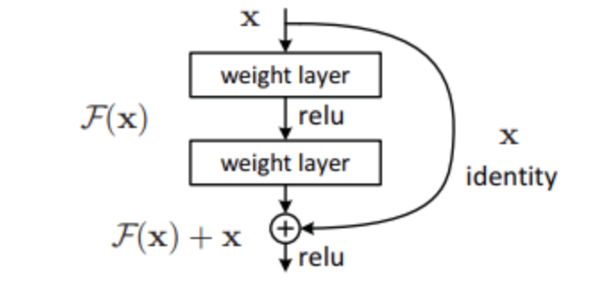
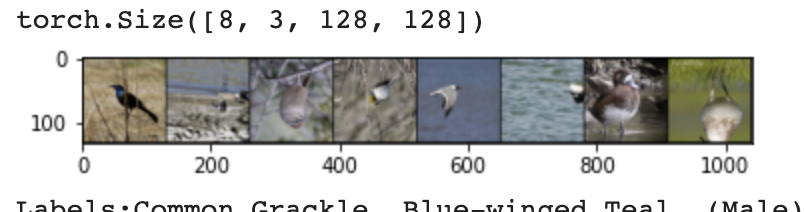
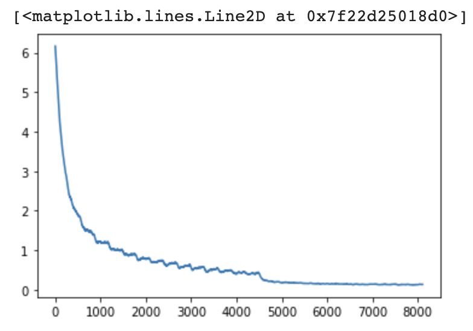

# Final Project: Kaggle Bird Competition

## Overview
This final project will be a summarization of what I learned about training a neural network as a bird classifier and what step I took to get a test accuracy of . Kaggle entry under tabletable.

### Starter Files and Goal
Thank you prof. Joe for providing the tutorial file.
[iPynb - Transfer Learning to Birds](https://colab.research.google.com/drive/1kHo8VT-onDxbtS3FM77VImG35h_K_Lav?usp=sharing)

Deliverable: a submission to [I Was Busy Thinkin' 'Bout Birds](https://www.kaggle.com/competitions/birds22sp/leaderboard)

## Terms
Words/concepts that were good to know

**Neural network** - layers of nodes connecting to the next layer's nodes with a certain weight and activation function. A neural network consists of the input layer where the data is provided, followed by a number of hidden layers, and finally the output layer of 'guesses'.

**Classifier** - using a neural network for classification means the output layer's vector maps to a certain number nominal categories (i.e. bird species).

**Birds** - a group of warm-blooded vertebrates constituting the class Aves /ˈeɪviːz/, characterized by feathers, toothless beaked jaws, the laying of hard-shelled eggs, a high metabolic rate, a four-chambered heart, and a strong yet lightweight skeleton. [wikipedia](https://en.wikipedia.org/wiki/Bird)

**activation functions** - defines whether a node should be activated in a weighted sum to increase the ability of the network to learn.

**gradients** - derivate in other terms. Use in back propagation, sample the gradient in opposite direction of model based on the weights to find a minimum.

**forward propagation** - calculation of vector values from the input layer to the output layer.

**backward propagation** - fine tuning the weights of the network by working from correct answer back to the previous layer and adjusting accordingly.

**weights** - the way a node transforms the input data and passes to the next layer, the 'amount' the value matters in the the next step.

**loss function** - based on the output of a neural network during training, the amount the prediction was wrong can be represented by this function and defines how much to change the weights during back propagation.

**learning rate** - a hyperparameter used during training, "how fast" the model can learn, usually ranges from .01-.0001

**momentum** - another hyperparameter that speeds up the learning of the model, allows the model to not get stuck in a local minimum gradient.

**training a network** - means to provide the neural network a bunch of label data so that the weights and the layers can be adjusted incrementally.

**over fitting** - when the model basically remembers the data it was trained on and cannot do the task it was trained to do with data its never seen.

**convolutional neural network** (CNN) - a neural network used to analyze visual data like images of birds.

**resnet** - Residual Networks, used for computer vision neural networks, made up of residual blocks, meaning the data going into the block is still relevant after going through the blocks layers with a "skip-connection".

Types: 18, 34, 50, these are the number of layers deep the network is. The more layers, the longer the training since forward and back propagation takes longer.

  

in pytorch, resnet is pre-trained on ImageNet

## Iterations

These are the steps I took to train the bird classifier.

**epochs** - 1 epoch means training the model with all of the training data once.
More epochs means the model learns more, but also might over fit the training data. I approach epochs as "the more the better" since the data augmentation randomized the images.

**schedule** - adjusting the learning rate at periodic epochs.
I used the 3 part learning schedule and used various number of epochs to initially train with a learning rate with .01 then .001 and finally .0001

### data augmentation
Possible data augmentation [transforms](https://pytorch.org/vision/main/auto_examples/plot_transforms.html#sphx-glr-auto-examples-plot-transforms-py) change the training data images in some way to change up the data to decrease the over fitting of the model.
Some of the transforms that were already used: resizing to make the image smaller and make training faster, cropping to take a random snapshot within an image, and random horizontal flip that does as it sounds.

    transforms.Resize(128),
    transforms.RandomCrop(128, padding=8, padding_mode='edge'),
    transforms.RandomHorizontalFlip(),

In addition to these, I used

    transforms.RandomRotation(degrees=(0, 90)),
    transforms.RandomAdjustSharpness(2),
    transforms.RandomAutocontrast(),
    transforms.RandomEqualize(),

But ended up using

    transforms.RandomAdjustSharpness(2),
    transforms.RandomVerticalFlip(),

Reasoning: Rotation provided a different image, but there was a lot of black space as a result of the rotation. Contrast and equalize were able to change the color of the bird which might affect the model's predictions. Sharpness would randomly sharpen an image, emphasizing a birds features which would be helpful I imagine. And since bird species are nominal values, an upside bird is still the same kind of bird, so this would add to the model's ability to learn.

Example images

  

check pointing - nice feature in pytorch to use an already trained network and start from there instead of restart training from scratch.

image size  - using 128px (shortest side) initially, then using 256px for network to learn more from. Larger size took a lot longer to train.

**attempt**: accuracy, followed by notes

**1**: 0.64149 base, running everything with no changes

**2**: 0.66450 using resnet 34, took quite a bit longer

**3**: 0.54700 back to resnest18, adding the initial data augmentation, using 4 more epoch (12 in total)

**4**: 0.66450  seems like the data augmentation was too much so model didn't learn, using adjusted data augmentation, more epoch (15), schedule {0:.01, 10:.001}

**5**: 0.70950 resnet 34, more epochs (20), schedule {0:.01, 7:.001, 10:.0001}
I realize I should have been saving the loss function graphs now..

**6**: 0.69400 resnet34, epoch (40), schedule {0:.01, 20:.001, 30:.0001}, probably too many epochs, over fitting even though loss function was lower by the end.

**7**: 0.82200 using larger image size (256), resnet34, epochs (20), schedule {0:.01, 10:.001, 15:.0001}
This took a very long time, but it's apparent, the more data the model has per image, the better it's able to learn.

loss function

  

**8**: 0.81750 image size (256), resnet34, epochs=27, schedule={0:.01, 15:.001, 21:.0001}, vertical flip, maybe model began to over fit?

I also tried to train from the end of some tries with a higher learning rate, but the loss function would increase and stay high instead.

## Video
[Summary Video](link)